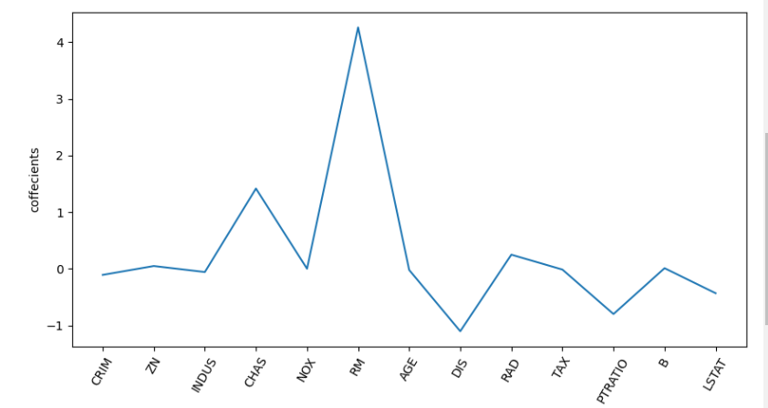
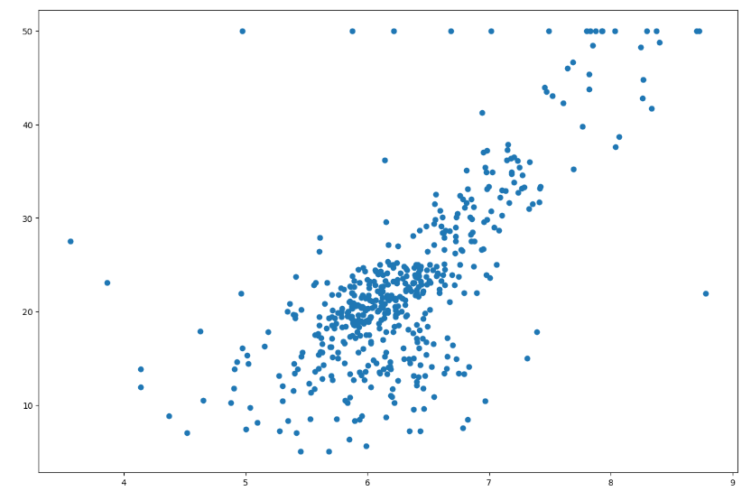
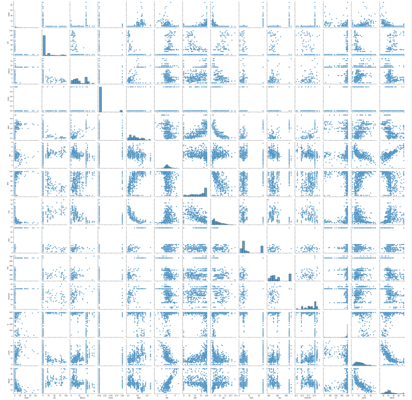

<h1 style="text-align: center; font-weight: bold;">
    Feature Selection with Lasso Regression
</h1>

<h2 style="text-align: center; font-weight: bold;">
    Coefficient vs Each Input Feature
</h2>

<h2 style="text-align: center; font-weight: bold;">
    Scattering the Selected Feature 
</h2>

<h2 style="text-align: center; font-weight: bold;">
    Seaborn output
</h2>

